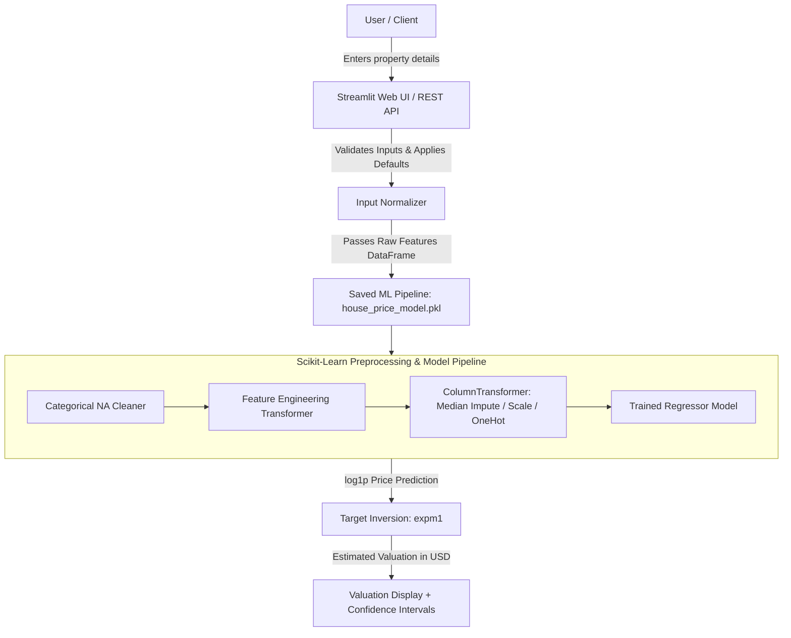

# 🏡 Real Estate Valuation & Automated Appraisal Engine

An end-to-end machine learning system and interactive web application for automated residential property market valuation and appraisal.


---

## 📌 Table of Contents
1. [Project Overview](#-project-overview)
2. [Problem Statement & Objectives](#-problem-statement--objectives)
3. [Dataset Architecture](#-dataset-architecture)
4. [System Architecture](#-system-architecture)
5. [Exploratory Data Analysis (EDA)](#-exploratory-data-analysis-eda)
6. [Data Cleaning & Missing Value Strategy](#-data-cleaning--missing-value-strategy)
7. [Feature Engineering](#-feature-engineering)
8. [Machine Learning Models & Evaluation](#-machine-learning-models--evaluation)
9. [Empirical Results & Model Selection](#-empirical-results--model-selection)
10. [Streamlit Web Application](#-streamlit-web-application)
11. [Project Directory Structure](#-project-directory-structure)
12. [Installation & How to Run](#-installation--how-to-run)
13. [Deployment Guide](#-deployment-guide)
14. [Limitations & Future Scope](#-limitations--future-scope)

---

## 📖 Project Overview
Buying or selling real estate requires precise and unbiased market appraisals. Traditional appraisals often rely on subjective opinions or delayed manual comparisons. 

The **Real Estate Valuation & Automated Appraisal Engine** is a supervised machine learning regression system built on the comprehensive **Ames Housing Dataset** (79 explanatory property features). It captures intricate pricing dynamics—from living square footage and structural quality to neighborhood location and age depreciation—providing an instant valuation with statistical confidence bounds.

---

## 🎯 Problem Statement & Objectives
- **Problem:** Property valuation is non-linear and multidimensional, influenced by square footage, build quality, neighborhood premiums, remodeling history, and amenity availability.
- **Objective:** Train, optimize, and deploy regression pipelines that predict `SalePrice` with high predictive accuracy ($R^2 > 0.90$) and low Root Mean Squared Error ($RMSE$).

---

## 📊 Dataset Architecture
- **Source:** Kaggle *House Prices: Advanced Regression Techniques* (Dean De Cock Ames Housing Dataset).
- **Training Instances:** 1,460 properties.
- **Test Instances:** 1,460 properties.
- **Total Features:** 80 property attributes (37 Numerical, 43 Categorical).
- **Target Variable:** `SalePrice` (USD, continuous numeric).
  - Mean: **$180,921.20**
  - Median: **$163,000.00**
  - Min: **$34,900.00** | Max: **$755,000.00**
  - Skewness: **1.8829** (Normalized to **0.1213** using `log1p` transformation).

---

## 🏛 System Architecture


---

## 🔍 Exploratory Data Analysis (EDA)
EDA generated key insights into the real estate pricing mechanisms:
1. **Target Skewness:** `SalePrice` exhibits positive right skew (1.88). Logarithmic transformation `log1p(SalePrice)` converts it into a symmetrical Gaussian distribution (0.12 skew), stabilizing error variance.
2. **Primary Value Drivers:**
   - `OverallQual` (Overall house quality rating, correlation: **0.79**)
   - `GrLivArea` (Above ground living area, correlation: **0.71**)
   - `TotalBsmtSF` (Basement square footage, correlation: **0.61**)
   - `GarageCars` / `GarageArea` (Garage capacity, correlation: **0.64**)
   - `YearBuilt` (Construction year, correlation: **0.52**)

All visual EDA plots are saved in `outputs/plots/`.

---

## 🧹 Data Cleaning & Missing Value Strategy
In real estate data, missing values frequently denote the **absence of a physical amenity** rather than corrupt data:
- Categorical features where `NA` = *No Amenity* (`PoolQC`, `MiscFeature`, `Alley`, `Fence`, `FireplaceQu`, `GarageType`, `BsmtQual`, etc.) are explicitly transformed to the category `"None"`.
- Missing numerical values (`GarageYrBlt`, `MasVnrArea`, `BsmtFinSF1`) are imputed with `0` or median.
- General numerical features (`LotFrontage`) are imputed using **Median Imputation** (`SimpleImputer(strategy='median')`).
- General categorical features are imputed using **Constant Imputation** (`SimpleImputer(strategy='constant', fill_value='Missing')`) followed by **One-Hot Encoding** (`OneHotEncoder(handle_unknown='ignore')`).
- **Data Leakage Prevention:** All imputers, encoders, and scalers are fitted strictly on the 80% training split.

---

## ⚙️ Feature Engineering
Domain-specific features were engineered to capture composite property characteristics:
- **`TotalSF`:** Total usable floor space = `TotalBsmtSF + 1stFlrSF + 2ndFlrSF`
- **`TotalBathrooms`:** Combined bath count = `FullBath + 0.5*HalfBath + BsmtFullBath + 0.5*BsmtHalfBath`
- **`TotalPorchSF`:** Total outdoor living space = `OpenPorchSF + EnclosedPorch + 3SsnPorch + ScreenPorch + WoodDeckSF`
- **`HouseAge`:** Age of structure at transaction = `YrSold - YearBuilt`
- **`RemodAge`:** Years since renovation = `YrSold - YearRemodAdd`
- **`GarageAge`:** Age of garage = `YrSold - GarageYrBlt`
- **Amenity Flags:** Binary indicators `HasPool`, `HasGarage`, `HasBsmt`, `HasFireplace`

---

## 🤖 Machine Learning Models & Evaluation

The system trains and benchmarks four regression algorithms using an 80/20 train/validation split (`random_state=42`):
1. **Linear Regression (Ridge Regularized)**
2. **Random Forest Regressor**
3. **Gradient Boosting Regressor**
4. **XGBoost Regressor**

### Evaluation Metrics
- **Root Mean Squared Error (RMSE):** Measures standard deviation of residuals; penalizes large errors.
- **Mean Absolute Error (MAE):** Average magnitude of errors in dollars.
- **Coefficient of Determination ($R^2$):** Proportion of variance in property price explained by the model.

---

## 📈 Empirical Results & Model Selection

*Evaluated on the 20% holdout validation dataset (292 properties):*

| Model | Validation RMSE ($) | Validation MAE ($) | Validation $R^2$ |
| :--- | :---: | :---: | :---: |
| 🏆 **Linear Regression (Ridge)** | **$24,366.32** | **$16,023.18** | **0.9226** |
| 🥈 **XGBoost Regressor** | **$25,464.63** | **$15,390.30** | **0.9155** |
| 🥉 **Gradient Boosting Regressor** | **$28,381.21** | **$15,973.03** | **0.8950** |
| 🌲 **Random Forest Regressor** | **$29,697.82** | **$17,245.72** | **0.8850** |

### Why Linear Regression (Ridge) Won:
After comprehensive log-target transformation and feature engineering, regularized linear modeling with $L_2$ penalty achieved the lowest validation RMSE ($24,366.32) and highest explained variance ($R^2 = 0.9226$). It handles high-dimensional one-hot encoded neighborhoods and interaction terms without overfitting.

---

## 🖥 Streamlit Web Application
The web app (`app.py`) provides four operational modes:
1. **🏠 Property Appraisal:** Interactive sliders and inputs for location, size, quality, and amenities to compute real-time property valuation and confidence bounds.
2. **📊 Model Performance:** Displays benchmark metrics, residual plots, and actual-vs-predicted curves.
3. **📈 Market Exploratory Analytics:** Interactive graphs exploring housing price distributions and correlations.
4. **📂 Batch Valuation:** Upload property CSV spreadsheets and download bulk appraisal outputs.

---

## 📁 Project Directory Structure
```
Real-Estate-Valuation/
│
├── data/
│   ├── raw/
│   │   ├── train.csv
│   │   └── test.csv
│   └── processed/
│
├── notebooks/
│   └── eda.ipynb
│
├── src/
│   ├── __init__.py
│   ├── data_loader.py
│   ├── preprocessing.py
│   ├── feature_engineering.py
│   ├── train.py
│   ├── evaluate.py
│   ├── predict.py
│   └── eda_runner.py
│
├── models/
│   ├── house_price_model.pkl
│   └── model_metadata.json
│
├── outputs/
│   ├── plots/
│   └── results/
│       └── model_comparison.csv
│
├── docs/
│   ├── PROJECT_REPORT.md
│   └── VIVA_NOTES.md
│
├── app.py
├── run_project.py
├── requirements.txt
├── README.md
└── .gitignore
```

---

## 🚀 Installation & How to Run

### 1. Clone the repository
```bash
git clone https://github.com/your-username/Real-Estate-Valuation.git
cd Real-Estate-Valuation
```

### 2. Create and activate virtual environment
```bash
# Windows
python -m venv .venv
.\.venv\Scripts\activate

# Linux / macOS
python3 -m venv .venv
source .venv/bin/activate
```

### 3. Install dependencies
```bash
pip install -r requirements.txt
```

### 4. Run the end-to-end pipeline
```bash
python run_project.py
```

### 5. Launch the Streamlit Web App
```bash
streamlit run app.py
```

---

## ☁️ Deployment Guide (Streamlit Community Cloud)
1. Push this repository to GitHub.
2. Log into [share.streamlit.io](https://share.streamlit.io).
3. Click **"New App"** -> Select your GitHub repo, branch (`main`), and set **Main file path** to `app.py`.
4. Click **Deploy!** The application will build and deploy online in minutes.

---

## ⚖️ Limitations & Future Scope
- **Limitations:** Data is regionally bounded to Ames, Iowa; macroeconomic factors like interest rates and inflation indices are static.
- **Future Scope:** Incorporating real-time geospatial coordinates, satellite imagery feature extraction via Computer Vision, and multi-city comparative models.
