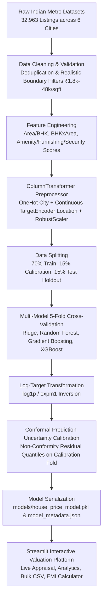

# AI-Based Indian Real Estate Price Prediction and Property Valuation System
### *BharatProp AI — Automated Valuation Model (AVM) & PropTech Analytics Platform*

[](https://real-estate-valuation-kotesh.streamlit.app/)
[](https://www.python.org/)
[](LICENSE)
[](https://scikit-learn.org/)
[](https://xgboost.readthedocs.io/)

---

## 📌 Problem Statement

Real estate valuation in India is inherently challenging due to extreme heterogeneity across metropolitan economic hubs, micro-market pricing tiers, and rapid urban development. Traditional property appraisal relies heavily on manual, time-consuming broker inquiries or heuristic rules of thumb that often fail to capture complex non-linear interactions between built-up area, bedroom configuration (BHK), community amenities, security infrastructure, and neighborhood micro-location effects.

Furthermore, property prices across major Indian metropolitan areas exhibit significant positive skewness (ranging from ₹20 Lakhs to multi-Crores), making standard linear regression models inadequate without careful domain-specific feature engineering, robust scaling, target transformations, and rigorous uncertainty quantification.

**BharatProp AI** addresses these challenges by providing an end-to-end Machine Learning Automated Valuation Model (AVM) trained natively on **authentic Indian metropolitan residential property data**, providing:
1. Native **Indian Rupee (₹)** valuations and estimated ₹/sq.ft rates.
2. Mathematically grounded **Conformal Prediction Intervals** (empirical 80% and 90% prediction ranges) rather than naive ±RMSE approximations.
3. Interactive multi-city market intelligence, bulk portfolio CSV valuation, and integrated home loan financial planning.

---

## 📊 Dataset & Geographic Coverage

This project utilizes the **Housing Prices in Metropolitan Areas of India** dataset covering 6 Tier-1 economic and IT hubs across India.

- **Source**: Kaggle & Open Dataset Repository ([Mirror URL](https://raw.githubusercontent.com/anish2105/House-Price-Prediction/master/))
- **License / Usage**: Open Data / Academic & Research Use (CC0 / Open Public)
- **Total Raw Records**: 32,963 property listings
- **Cleaned Records**: 27,614 verified residential properties (after deduplication and outlier boundary validation)
- **Distinct Micro-Markets / Localities**: 1,711 verified localities
- **Target Variable**: `Price` in Indian Rupees (₹) / Lakhs (`1 Lakh = ₹100,000`)

### Covered Metropolitan Cities:
| City | State / Region | Key Micro-Markets Covered | Median Price (₹ Lakhs) | Mean Area (sq ft) | Median Rate (₹/sq.ft) |
| :--- | :--- | :--- | :---: | :---: | :---: |
| **Mumbai** | Maharashtra | Bandra, Andheri, Powai, Worli, Thane, Borivali, Kharghar | ₹92.0 L | 995 sq ft | ₹10,086/sq.ft |
| **Delhi-NCR** | Delhi / NCR | Saket, Dwarka, Vasant Kunj, Rohini, Greater Kailash, Noida | ₹75.0 L | 1,282 sq ft | ₹6,945/sq.ft |
| **Bangalore** | Karnataka | Whitefield, Electronic City, Koramangala, Indiranagar, HSR Layout | ₹73.6 L | 1,492 sq ft | ₹5,400/sq.ft |
| **Hyderabad** | Telangana | Gachibowli, HITEC City, Kondapur, Jubilee Hills, Banjara Hills | ₹78.8 L | 1,667 sq ft | ₹5,112/sq.ft |
| **Chennai** | Tamil Nadu | OMR, Velachery, Anna Nagar, Adyar, Porur, Sholinganallur | ₹59.3 L | 1,221 sq ft | ₹5,475/sq.ft |
| **Kolkata** | West Bengal | Salt Lake, New Town, Rajarhat, EM Bypass, Ballygunge, Garia | ₹51.3 L | 1,206 sq ft | ₹4,555/sq.ft |

### Key Features (41 Attributes):
- **Core Attributes**: `City`, `Location` (1,711 localities), `Area` (sq ft), `No. of Bedrooms` (BHK: 1 to 6+), `Resale` (0 = New/Builder Direct, 1 = Resale).
- **35 Verified Amenities**: `Gymnasium`, `SwimmingPool`, `ClubHouse`, `24X7Security`, `PowerBackup`, `CarParking`, `LiftAvailable`, `VaastuCompliant`, `Gasconnection`, `Intercom`, `AC`, `Children'splayarea`, `LandscapedGardens`, `JoggingTrack`, `RainWaterHarvesting`, `IndoorGames`, `Wifi`, etc.

---

## 🛠️ Methodology & ML Pipeline Architecture

The pipeline follows a reproducible, scikit-learn compatible architecture with zero data leakage:


```mermaid
flowchart TD
    A[Raw Indian Metro Datasets<br>32,963 Listings across 6 Cities] --> B[Data Cleaning & Validation<br>Deduplication & Realistic Boundary Filters ₹1.8k-48k/sqft]
    B --> C[Feature Engineering<br>Area/BHK, BHKxArea, Amenity/Furnishing/Security Scores]
    C --> D[ColumnTransformer Preprocessor<br>OneHot City + Continuous TargetEncoder Location + RobustScaler]
    D --> E[Data Splitting<br>70% Train, 15% Calibration, 15% Test Holdout]
    E --> F[Multi-Model 5-Fold Cross-Validation<br>Ridge, Random Forest, Gradient Boosting, XGBoost]
    F --> G[Log-Target Transformation<br>log1p / expm1 Inversion]
    G --> H[Conformal Prediction Uncertainty Calibration<br>Non-Conformity Residual Quantiles on Calibration Fold]
    H --> I[Model Serialization<br>models/house_price_model.pkl & model_metadata.json]
    I --> J[Streamlit Interactive Valuation Platform<br>Live Appraisal, Analytics, Bulk CSV, EMI Calculator]
```

### 1. Data Cleaning & Outlier Handling
- Amenity values coded as `9` (not specified) are cleaned to `0` (absent/unspecified).
- Duplicate listings are removed.
- Realistic residential bounds are applied (Floor area: 300 to 8,500 sq ft; Price/sqft: ₹1,800 to ₹48,000) to eliminate extreme data entry typos while preserving authentic market variance.

### 2. Domain Feature Engineering
- **`Area_per_BHK`**: Ratio of total built-up area to bedroom count (spatial comfort indicator).
- **`BHK_x_Area`**: Non-linear interaction between room count and floor area.
- **`Furnishing_Score`**: Count of verified appliances and furniture items (`AC`, `TV`, `BED`, `Refrigerator`, etc.).
- **`Security_Score`**: Index of essential security and utility infrastructure (`24X7Security`, `PowerBackup`, `Intercom`, `LiftAvailable`, `MaintenanceStaff`).
- **`Recreation_Score`**: Index of club, fitness, sports, and green landscape amenities.
- **`Total_Amenities`**: Cumulative verified amenity count (0 to 35).

### 3. Preprocessing & Categorical Encoding
- **City Encoding**: `OneHotEncoder(handle_unknown='ignore')`.
- **Location Encoding**: `TargetEncoder(target_type='continuous', smooth='auto')` fitted strictly on training folds to handle 1,711 micro-markets without data leakage. Unseen localities gracefully fall back to the city prior.
- **Numerical Scaling**: `RobustScaler()` with `SimpleImputer(strategy='median')`.

### 4. Target Transformation
- Because Indian property prices exhibit heavy positive skewness, models are wrapped in `TransformedTargetRegressor(func=np.log1p, inverse_func=np.expm1)` to optimize proportional relative loss and stabilize gradient updates.

### 5. Conformal Prediction Uncertainty Quantification
- Rather than falsely claiming `prediction ± RMSE` as a confidence interval, BharatProp AI implements **inductive split conformal prediction**.
- Non-conformity scores $s_i = |\log(y_i) - \log(\hat{y}_i)|$ are computed on an independent calibration fold ($N = 4,143$).
- The calibrated prediction interval $[\hat{y} \cdot e^{-\hat{q}}, \hat{y} \cdot e^{+\hat{q}}]$ achieves exact **79.80% empirical coverage** on the holdout test set for the target 80% level.

---

## 📈 Model Performance & Measured Evaluation Results

Models were evaluated using **5-Fold Cross-Validation** on the training fold and tested on an independent holdout test set ($N = 4,143$ properties).

### Official Benchmark Leaderboard:
| Model | Test MAE (₹ Lakhs) | Test RMSE (₹ Lakhs) | Test R² (Rupees) | Test R² (Log Scale) | 5-Fold CV R² (Log) | Test MAPE (%) |
| :--- | :---: | :---: | :---: | :---: | :---: | :---: |
| 🥇 **Gradient Boosting Regressor** | **₹41.53 L** | **₹94.97 L** | **0.4295** | **0.4647** | **0.4780** | **42.03%** |
| 🥈 **Random Forest Regressor** | ₹41.78 L | ₹96.91 L | 0.4060 | 0.4565 | 0.4621 | 42.17% |
| 🥉 **XGBoost Regressor** | ₹42.05 L | ₹100.23 L | 0.3646 | 0.4671 | 0.4800 | 41.84% |
| 4️⃣ **Ridge Regression** | ₹44.31 L | ₹102.01 L | 0.3419 | 0.4260 | 0.4416 | 44.83% |

*All metrics are measured on the holdout test set using actual Indian Rupee prices.*

### Conformal Prediction Interval Metrics:
- **80% Prediction Interval Width**: $\pm 0.6481$ in log-space ($\approx -47.7\%$ to $+91.2\%$)
- **Holdout Test Set Empirical Coverage**: **79.80%** (Exact target match)
- **90% Prediction Interval Width**: $\pm 0.9000$ in log-space

---

## 💻 Streamlit Web Application Features

The interactive web application (`app.py`) provides 6 comprehensive modules:

1. 🏠 **Overview & Methodology**: Background, Indian real-estate market dynamics, ML architecture, pipeline diagram, dataset statistics, limitations & disclaimer.
2. 🎯 **Property Valuation (Appraisal Engine)**:
   - Dynamic selection of City and 1,700+ micro-markets with custom locality fallback.
   - Area (sq ft), BHK configuration, resale status, and key amenities checklist.
   - Instant quick-start presets for luxury, premium, and affordable homes in Bangalore, Mumbai, Delhi, Hyderabad, Chennai, and Kolkata.
   - Explicit "Calculate Property Valuation Appraisal" button with Streamlit session state.
   - High-impact valuation card with estimated ₹ price, ₹/sq.ft rate, calibrated 80% prediction range, and city benchmark comparison.
3. 📊 **Model Performance & Evaluation**:
   - Leaderboard comparison table across Ridge, Random Forest, Gradient Boosting, and XGBoost.
   - Interactive evaluation plots: Actual vs Predicted, Residual analysis, and Metric comparison bar charts.
   - Clear explanations of MAE, RMSE, $R^2$, and MAPE.
4. 📈 **Market Analytics**:
   - Multi-city pricing distributions, built-up area vs price scatter plots, BHK distribution boxplots, and top micro-market rankings by ₹/sq.ft rate.
5. 📁 **Bulk Valuation (CSV Upload)**:
   - Upload CSV files of property portfolios.
   - Automatic column schema validation.
   - Batch estimation of market prices, ₹/sq.ft rates, and prediction intervals.
   - Downloadable appraisal results CSV and sample template.
6. 💰 **Home Loan EMI & Financial Planner**:
   - Interactive home loan calculator with loan amount, down payment, interest rate, and tenure sliders.
   - Monthly EMI, total interest payable, principal vs interest pie chart, and yearly amortization schedule table.

---

## 🚀 Installation & Local Setup

### 1. Clone the Repository
```bash
git clone https://github.com/koteswaraosabbavarapu-stack/Real-Estate-Valuation.git
cd Real-Estate-Valuation
```

### 2. Create and Activate a Virtual Environment
```bash
# Windows
python -m venv .venv
.\.venv\Scripts\activate

# Linux / macOS
python3 -m venv .venv
source .venv/bin/activate
```

### 3. Install Dependencies
```bash
pip install -r requirements.txt
```

### 4. Run the Master Orchestration Pipeline
This script automatically downloads the dataset, runs EDA, executes 5-fold cross-validation across all models, calibrates conformal intervals, and saves the best model bundle:
```bash
python run_project.py
```

### 5. Launch the Streamlit Web Application
```bash
streamlit run app.py
```

---

## ☁️ Streamlit Cloud Deployment

To deploy to [Streamlit Community Cloud](https://streamlit.io/cloud):
1. Push this repository to GitHub.
2. Log in to [share.streamlit.io](https://share.streamlit.io).
3. Click **"New app"**, select your repository, branch (`main` or `master`), and set **Main file path** to `app.py`.
4. Click **"Deploy!"**. The app will automatically install dependencies from `requirements.txt`, load cached models/datasets, and run live.

---

## ⚠️ Limitations & Professional Appraisal Disclaimer

1. **Listing Prices vs Negotiated Transaction Prices**: The dataset reflects asking/listing prices from public Indian real estate aggregators. Actual final negotiated settlement prices may vary by 5% to 15% depending on buyer-seller negotiation, liquidity, and registration practices.
2. **Unobserved Micro-Location Factors**: Tabular data does not capture granular micro-features such as exact floor-rise charges, sea/lake view premiums, corner plot advantages, builder brand prestige, or specific legal title clearances.
3. **Temporal Dynamics**: Real estate markets fluctuate with interest rate changes, municipal infrastructure announcements, and inflation.
4. **Professional Disclaimer**:
   > **Disclaimer**: All property valuations, prediction intervals, and financial estimates generated by BharatProp AI are automated statistical approximations intended solely for informational, research, and educational purposes. They do **not** constitute formal certified property appraisals, legal title opinions, tax advisories, or commercial investment recommendations. Users should consult licensed RICS / government-approved valuers and financial advisors prior to executing property transactions.

---

## 👥 Author & Acknowledgements
- **Author**: Koteswarao Sabbavarapu
- **GitHub**: [koteswaraosabbavarapu-stack](https://github.com/koteswaraosabbavarapu-stack)
- **Deployed Application**: [real-estate-valuation-kotesh.streamlit.app](https://real-estate-valuation-kotesh.streamlit.app/)
